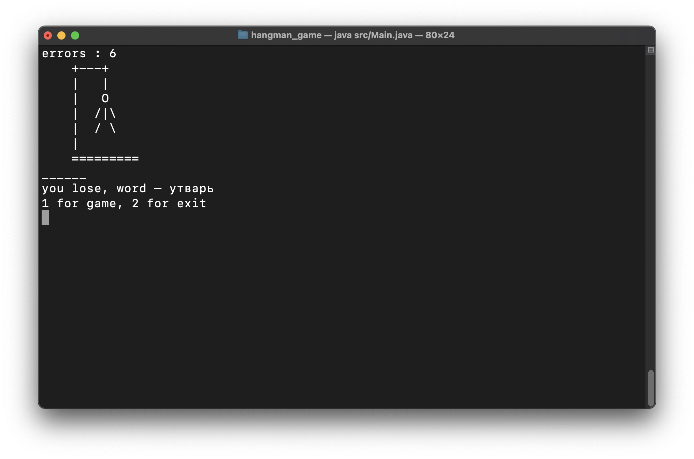
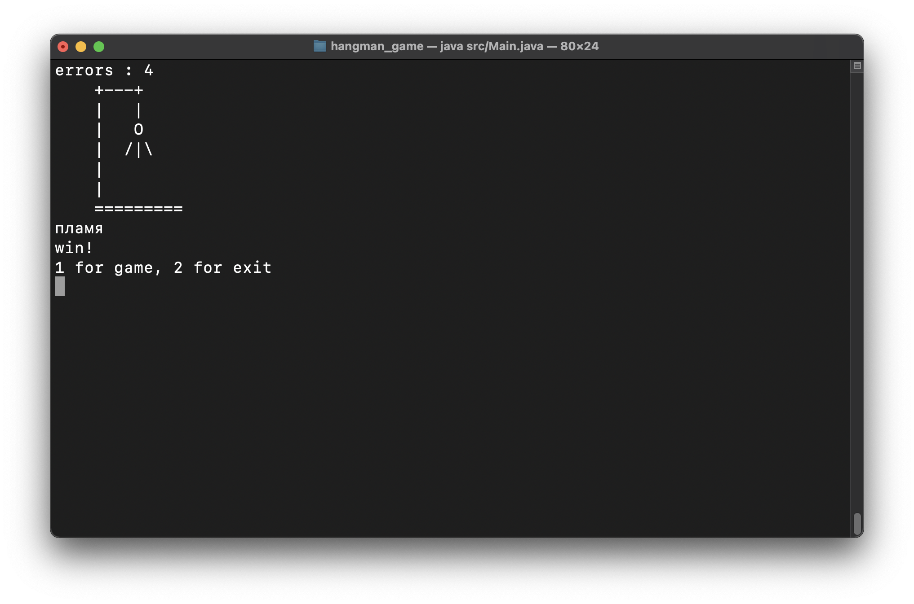

# Игра "Виселица"

Классическая игра в слова, реализованная на языке Java, в консольном интерфейсе. Словарь загаданных слов находится в resource/words.txt.
___

Для успешного запуска приложения:
- откройте терминал
- перейдите в папку `hangman_game/src`
- скомпилируйте программу `javac main/*.java`
- запустите игру `java main/Main.java`

